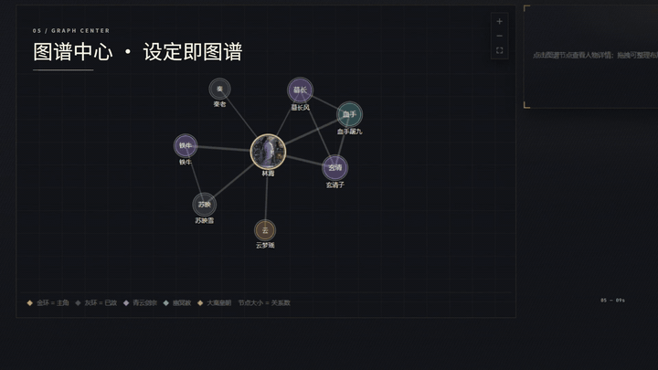

# 墨枢 NovelAtlas —— AI 小说创作一致性管理工作台

> 把小说设定沉淀为知识图谱，在写作的每一步校验一致性，并把"恰好够用"的设定喂给 AI —— 让任何模型写长篇都不崩人设。
> **纯前端项目**：数据 100% 存本地，预置可替换的存储/双 AI 接口。




*图谱中心 · 关系网络 / 事件因果 / 人物轨迹（截自产品导览片 `videos/moshu-tour`）*

## 快速开始

```bash
npm install
npm run dev        # http://localhost:5173
npm run build      # 产物在 dist/（tsc 严格检查 + vite 打包）
npm run preview    # 本地预览构建产物
npm run app:build  # Windows 桌面安装包（NSIS 标准向导：可选安装目录、完成页可勾选启动）+ 便携版 → release/
```
首次进入自动载入示例作品《九州烟云》（含人物关系/事件因果/三章正文），所有功能开箱即玩。

## 核心功能

| 模块 | 说明 |
| --- | --- |
| 总览 | 参考数据大屏风格：主角英雄卡（形象/幽灵数字雷达/三卡行/2×2 信息格）+ 事件统计表 + 章节记分卡 |
| 写作台 | 章节编辑（编辑/预览）· 实体自动高亮 · **未登记名词提示**（设为人物/登记别名/忽略）· 一致性体检 · **上下文包**一键复制/发送给 AI · **查找替换**（Ctrl+F，支持正则/大小写，全部替换前自动留档）· **版本历史**（每 10 分钟自动快照 + 手动快照 + 一键回滚，每章上限 20 条） |
| 人物设计器 | 档案 + 五维雷达 + 关系编辑 + 别名管理 + 形象上传（无图自动白底剪影占位） |
| 事件设计器 | 时间标签/排序号/地点/参与人物/前因后果，全部走图谱联想选择器 |
| 物品/地点/势力 | Schema 驱动的通用设计器，引用一律为实体 |
| 图谱中心 | D3 关系图谱（力导向）· 事件图谱（时间因果网络）· 人物轨迹（时间轴路径）· **AI 建谱**（粘贴正文 → AI 抽取实体/关系/事件 → 勾选确认批量入库，解决图谱冷启动） |
| 时间线 | 编年体事件流，按人物过滤 |
| 导出 | TXT / Markdown / **DOCX**（docx 库）/ **EPUB3**（JSZip）/ JSON 备份恢复 |
| 设置 | 存储适配器切换（IndexedDB / LocalStorage / **REST 预置**）· AI 接口（OpenAI 兼容）· 多作品管理 |

## 版本记录

- **v1.1.0**（2026-09）：写作台查找替换；章节版本历史（自动/手动快照 + 回滚，全部替换前强制留档）；AI 建谱（正文 → AI 抽取 → 确认批量入库）。
- **v1.0.0**（2026-08）：一致性引擎三层提示体系、五类实体设计器、图谱三视图、上下文包、五种格式导出、多作品管理。

## "和图谱对不上"的三层提示（本产品灵魂）

1. **写作台实时识别**：已登记实体着色高亮；未登记名词（词频+虚词过滤+相似名联想）出琥珀警示卡，可一键建档/登记别名/忽略。
2. **表单引用兜底**：所有实体字段走联想选择器；无匹配时提示"图谱中没有「xx」"，禁止自由文本引用（自由文本 = AI 拿不到设定 = 写崩源头）。
3. **全项目体检**：悬空引用 / 别名冲突 / 因果时序倒挂 / 近名提醒，总览聚合健康度。

## 存储接口契约（替换即可上云）

```ts
interface StorageAdapter {
  listProjects(): Promise<ProjectMeta[]>;
  loadProject(id: string): Promise<Project | null>;
  saveProject(p: Project): Promise<void>;
  deleteProject(id: string): Promise<void>;
}
```

REST 预置适配器（设置页填 Base URL 即用，`Authorization: Bearer <token>` 可选，服务端需开 CORS）：

```
GET    {base}/projects        → { projects: ProjectMeta[] }
GET    {base}/projects/:id    → { project: Project }
PUT    {base}/projects/:id    body { project } → { ok: true }
DELETE {base}/projects/:id    → { ok: true }
```

AI 接口为 OpenAI 兼容协议（`{base}/chat/completions`），配置后写作台可直接用上下文包请求续写。

## 目录

```
docs/     产品文档（调研报告 / PRD / 原型稿 / 设计稿 / 技术设计）
src/
  core/       领域层：types / consistency(一致性引擎) / contextPack / storage(适配器) / export / seed
  store/      Zustand：projectStore(自动保存+级联删除) / uiStore(路由+Toast+确认)
  components/ 自研组件库（玻璃拟态设计系统，规范见 docs/04）
  features/   11 个页面模块
  layouts/    全局壳层
  styles/     tokens / base / components / pages
```

## 产品文档索引

1. `docs/01-调研报告-AI小说工具调研.md` —— Novelcrafter Codex / SillyTavern 世界书 / 国内工具对比
2. `docs/02-产品需求说明书-PRD.md` —— 功能需求 + 三层提示体系 + 接口契约
3. `docs/03-原型稿-页面原型与交互.md` —— 线框与交互流
4. `docs/04-设计稿-视觉设计规范.md` —— Design Tokens 与组件规范
5. `docs/05-技术设计文档.md` —— 架构 / 数据模型 / D3 / 导出管线
# sk-ms
